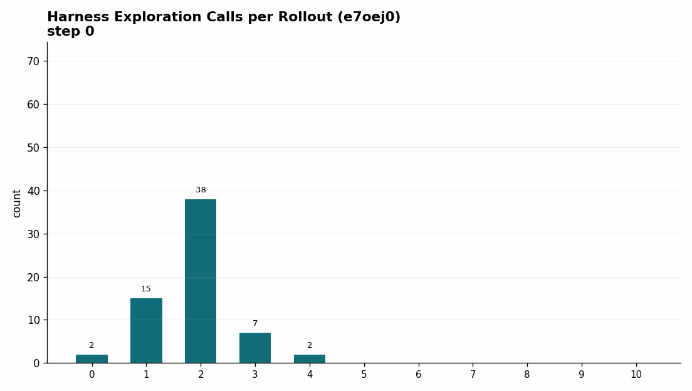

# Training RLMs to Relax Crystals

## Scientific diary

Writing about RL has too many entry points.

You can write about gradients, losses, advantages, and updates.
You can write about the model.
Did it learn?
What did it learn?
How did it learn?

The middle level is the useful one here.
The model reads files.
It writes code.
It calls a checker.
It revises a CIF.
It decides when to stop.

That makes the main question:

> What does an LLM actually learn when we train it to relax crystals through a filesystem?

The RLM setup made crystal relaxation more agentic.
It made the task easier to inspect.
It did not make the physics easy.
The model learned the workspace.
The traces exposed the failures.
Formation energy stayed hard.

## From MultiTurnEnv to RLM

The original crystal relaxation environment was a classic `MultiTurnEnv`.

The model received an unrelaxed crystal structure.
It proposed a relaxed version.
The environment gave feedback.
The model tried again.

That worked.
It also forced a chat-shaped rhythm: answer, feedback, answer, feedback.

The RLM version changes the unit of work.
A task is a small filesystem:

- `input.cif` contains the unrelaxed structure.
- skills expose the tools the model is allowed to use.
- the sandbox gives the model a real place to run code and inspect intermediate state.
- `/task/final.cif` is the final answer.

The difference is easiest to see by comparing a dataset row with a taskset question.

| id | prompt | info | solution |
|---|---|---|---|
| `mp-690760` | Relax this crystal structure. | `{unrelaxed_cif, composition, target_energy}` | `relaxed_cif` |
| `mp-976260` | Return a lower-energy CIF. | `{mp_id, cluster, reference_metrics}` | `relaxed_cif` |

The RLM task is a filesystem instead:

```text
/task
|-- prompt.txt
|-- inputs
|   `-- input.cif
|-- rlm-skills
|   `-- check_structure
|       |-- SKILL.md
|       `-- src/...
|-- workdir
|   |-- candidate.cif
|   `-- scratch.py
`-- final.cif
```

The old setup tested short repair.
Emit a plausible CIF.
Read feedback.
Try again.

The RLM setup tests agent work.
Inspect the input.
Use Python.
Call a checker.
Revise a candidate.
Converge on a better structure.

The architecture became three parts:

```text
Taskset
  owns the data slice, task files, and per-example filesystem

Harness
  owns the system prompt, available tools, and workflow contract

Environment
  orchestrates rollouts, runs scoring, and records results
```

This decomposition mattered more than I expected.
It made the environment easier to reason about.
It also made hidden assumptions easier to see.

### RLM search

Prime Intellect's [`rlm_search` environment](https://github.com/PrimeIntellect-ai/research-environments/tree/main/environments/rlm_search) was the useful reference.
Same pattern.
Different domain.
It runs web search and research tasks instead of crystal relaxation.

The taskset can switch between QUEST, OpenSeeker, and REDSearcher.
The model gets local skills such as `websearch` and `open_webpage`.
The answer goes to `/task/answer.txt`.
The scorer reads the file.

The implementation is small and clarifying.
`load_environment` builds a search taskset.
It attaches the bundled skills directory.
It appends the final-answer file contract to the system prompt.
It creates an `rlm_harness`.
It wraps everything in a `ComposableEnv`.

The selected taskset owns scoring.
The harness owns the sandbox workflow.
My crystal environment follows the same shape.
The taskset owns structures and files.
The harness gives the model a workspace and tools.
Scoring reads the final artifact.

### RLM harness

The [RLM harness](https://github.com/PrimeIntellect-ai/rlm-harness) is deliberately narrow.
It is a training harness for agentic rollouts.
It is not a general chat UI.

The model gets a long-lived IPython control surface as its built-in tool.
From there it can read and write files.
It can run shell commands through explicit bash cells.
It can call installed skills.
It can spawn recursive sub-agents when recursion is enabled.

At runtime, the harness builds a system prompt from the working directory, session log path, installed skills, recursion setting, and active tool set.
Then it runs a simple loop.
Call the model.
Allow one built-in tool call.
Execute it.
Append the observation.
Log the turn.
Repeat until the model stops or hits budget.

Every run writes a session directory with metadata, messages, tool results, and child sessions.
That trace made the crystal experiments inspectable.

## Checker skill

The main implementation step was translating the old `MultiTurnEnv` feedback function into a skill.

In the old environment, feedback was automatic. After every model answer, the environment returned a score and diagnostic text. In the RLM environment, the model has to decide when to ask for that feedback.

The checker skill became the bridge:

```text
candidate CIF -> check_structure -> parseable?
                              -> composition correct?
                              -> bond lengths reasonable?
                              -> formation energy acceptable?
                              -> force proxy reasonable?
                              -> feedback text
```

The checker gave the model agency.
It also created a control problem.
A free checker becomes an infinite checker.
So I added a check budget.
Roughly, two old feedback turns became two allowed RLM checks.

This is where the environment stopped feeling like a normal benchmark.
The wording of the skill is a hyperparameter.
If the skill encourages broad exploration, the model explores.
If it makes the checker feel central, the model checks earlier.
The tool changes the policy we train.

## Prompt contract

The system prompt is shared across tasks.
The task family is shared too: start with an unrelaxed structure and produce a relaxed one.

The individual question can stay generic.
The per-example information lives in `input.cif`.
That was the point of moving into an RLM-style taskset.
The prompt does not need to carry every detail.
The filesystem does.

The final contract is also simple:

```text
write the best candidate structure to /task/final.cif
```

That removes a whole class of answer-extraction problems.
No CIF extraction from chat.
No tag parsing.
No prose cleanup.
The artifact is the answer.

For crystal relaxation, this fit the task.
The model can still explain itself.
The grader reads the final CIF.

One scaling detail matters.
The expensive final reward does not require a full scoring model inside every rollout sandbox.
The model writes `/task/final.cif`.
The rollout stops.
The environment keeps the sandbox alive long enough for scoring to read the file and run the private checker path.
In code, this is `keep_sandbox_for_scoring=True`.
The sandbox is the artifact container.
It is not a replicated model host.

During the rollout, the agent gets bounded public feedback through the checker skill.
After the rollout, final scoring uses the hosted formation-energy model once, centrally, against the saved final CIF.
That keeps RLM training scalable.
Thousands of sandboxes can hold files and run lightweight tools.
The heavier model-backed reward is paid only at the end of each trajectory.

## Metadata leak

The first serious implementation bug was a data leak.

In the previous dataset paradigm, each example had an `info` object. It was useful for reward computation because it could hold metadata hidden from the model. When I moved to a filesystem task, I initially included too much of that metadata in the workspace.

One of the leaked fields was the original Materials Project id.

The model noticed.
It tried to look up the material through the Materials Project API.
It stopped behaving like a relaxation agent.
It started behaving like a lookup agent.

The lesson was simple:

> In an RLM environment, the filesystem is part of the prompt.

Anything placed in the task directory should be treated as visible model context. Private scorer metadata has to stay private.

## Baselines

Before training, I needed to know whether the RLM version was viable at all.

The answer was yes.
The caveat was large.
Classic stayed easier in short runs.
It gives feedback in a tight, controlled loop.
Strong frontier models can nearly saturate it.

| Surface | Model | Run shape | Mean reward | pass@1 | pass@2 | Notes |
|---|---|---:|---:|---:|---:|---|
| Classic | GPT-5.5 | 25x3 | 0.998 | 1.000 | 1.000 | Best corrected classic run. |
| Classic | GPT-5.5 | 25x3, 3 turns | 0.758 | 0.760 | 0.880 | Strong with 32% model/API errors. |
| RLM | GPT-5.5 | 25x3, 15 turns, 5 checks | 0.783 | 0.733 | 0.760 | Best RLM run so far, 55/75 full-credit rollouts. |

This comparison is not a clean win/loss claim.
The surfaces ask different questions.

Classic tests short direct repair.
RLM tests tool-mediated scientific work.

Early RLM looks worse for a simple reason.
The model has two jobs.
Learn the harness.
Learn the filesystem.
Learn the tools and final-file contract.
Then solve the chemistry.

Classic removes much of that interface burden.
It gives feedback in the same chat loop every time.

That matters for training.
Parser failures teach almost nothing.
A failed low-energy search teaches something.
If the model preserved composition and bond lengths, I know where the policy is weak.

## RLM evals

The first RLM evals were noisy, and some of the noise was not model behavior.

The most useful sequence was the GPT-5.5 budget and sandbox sweep:

| Eval | Budget | Mean reward | pass@1 | pass@2 | Full credit | Interpretation |
|---|---|---:|---:|---:|---:|---|
| `45491238` | 5 turns / 1 check | 0.618 | 0.493 | 0.587 | 37/75 | Strong short-budget RLM reference. |
| `003b7c4d` | 10 turns / 3 checks | 0.341 | 0.240 | 0.347 | n/a | Dependency/interpreter path issue. |
| `34ff5575` | 10 turns / 3 checks | 0.516 | 0.440 | 0.520 | 33/75 | Cleaner dependency path. |
| `60cf0943` | 15 turns / 5 checks | 0.783 | 0.733 | 0.760 | 55/75 | Best RLM result so far. |

At first, the larger trusted-image run looked like a regression.
The later non-trusted rerun changed the story.
More turns were not the problem.
The trusted image launched into the wrong dependency path for these rollouts.

Once that was fixed, increasing from 10 turns / 3 checks to 15 turns / 5 checks helped GPT-5.5 a lot. Mean reward moved from `0.516` to `0.783`, and full-credit rollouts moved from `33/75` to `55/75`.

The remaining zero-reward cases in the best run were mostly sandbox readiness failures.
Those were infrastructure failures.
The remaining non-perfect completed rollouts were harder chemistry cases.
The model could satisfy easier checks and still miss formation energy.

## Cross-model

The larger RLM budget helped models differently.

| Model | 10/3 mean | 15/5 mean | Delta | What changed |
|---|---:|---:|---:|---|
| GPT-5.5 | 0.516 | 0.783 | +0.267 | Converted extra checks into full-credit structures. |
| GPT-5.4-mini | 0.376 | 0.408 | +0.032 | Reliable format/composition, weak energy recovery. |
| Gemini 2.5 Flash | 0.297 | 0.259 | -0.038 | More budget did not improve composition or energy. |
| Claude Haiku 4.5 | 0.303 | 0.454 | +0.151 | Benefited from budget. Used many turns. |

Aggregate reward hides too much.
The rubric components tell the real story.

GPT-5.4-mini is the cleanest example.
It became reliable at format and composition.
Formation energy stayed low.
Mean reward looked acceptable.
Pass rates stayed weak.
The model learned the easy contract.
It did not learn the hard physics.

Claude showed a different pattern.
The larger budget helped.
The run was expensive in turns.
It often needed most of the available trajectory.

Gemini showed the opposite lesson: more turns are not automatically better. A larger workspace budget only helps if the model knows how to use it.

## Training diary

The training runs are where the RLM setup became most interesting.

The two runs I looked at most were a batch-128 run and a batch-256 run. The batch-128 run peaked around step `70`. The batch-256 run peaked around step `90`, with mean reward around `0.527`.

Reward moved.
Workflow moved too.

### Training reports

Start here for the raw details.
The reports are interactive HTML audits.
They include step controls, rollout tables, tool-call tags, error taxonomies, and scalar metric plots.

Earlier runs:

- [Earlier batch-128-style run](../outputs/rlm_training_analysis/pdjhyq25on9s4vyrxy04x87v/multi_step_report.html): reward peaked around step `70`.
- [Earlier batch-256-style run](../outputs/rlm_training_analysis/e7oej0cxoe3j6lwy0tz9euou/multi_step_report.html): reward peaked around step `90`.

Latest long runs:

- [Run `x7b6izu...`](../outputs/rlm_training_analysis/x7b6izuqqfn4ouzk79e9wpz4/multi_step_report.html): reached about `500` in-flight rollouts and peaked at metric reward `0.623` near step `116`.
- [Run `o8spwu...`](../outputs/rlm_training_analysis/o8spwu5abkdvne8oakwy02kx/multi_step_report.html): capped near `200` in-flight rollouts and peaked early at metric reward `0.467` near step `20`.

### Harness exploration

The first behavior was not chemistry.
It was orientation.
The model spent budget learning the harness.
Read the input.
Read the skill.
List files.
Probe the sandbox.
Try Python.
Sometimes it never wrote a useful candidate.

That exploration was expensive.
It used turns.
It used decode length.
It created timeouts.
Timeouts were zero-reward trajectories.

One of the quickest training changes was simple: stop wasting turns on orientation.
Read what matters.
Act earlier.
Call the checker earlier.
Avoid timing out.

That is one reason decode length and number of turns drop sharply early in training.
The model is not becoming less capable.
It is becoming less lost.

Later in training, it checked earlier and combined candidate generation with checker calls inside the same tool turn.


### Code writing

The RLM setup made code quality visible.
That was new.
The model was not graded on Python style.
Still, Python quality controlled the rollout.
Bad imports blocked geometry analysis.
Bad loops blocked distance checks.
Silent code produced no signal.

The eval baselines separated two abilities.
Some models wrote cleaner tool code.
Some models used messy code and still got better structures.

| Model | Clean eval signal | Code-writing read |
|---|---|---|
| GPT-5.5 | Best reward: `0.783` at 15 turns / 5 checks. Tool-error rate was about `12.5%` on that run. | Strongest problem solver. More willing to use Pymatgen, tools, and longer workflows. Also more exposed to import errors, timeouts, and type errors. |
| GPT-5.4-mini | Lower reward: `0.408` at 15 turns / 5 checks. Tool-error rate about `2.6%`. | Cleaner mechanics. Good at format, composition, and file handling. Less effective at turning code into low-energy structures. |
| Gemini 2.5 Flash | Tool-error rates stayed around `1-3%` on clean runs. Reward did not improve with more budget. | Concise and low-error. Often wrote enough file-management code to finish. Less evidence of useful deeper search. |
| Claude Haiku 4.5 | Tool-error rate about `2.1%` at 15 turns / 5 checks. Reward rose to `0.454`. | Best low-error code behavior among the non-GPT runs. It used more turns and did more analysis. Expensive. More systematic. |

Training changed the bug profile too.
At step `0`, the runs were full of raw coding failures.
The batch-256-style run had `94` runtime code errors, `23` syntax errors, and `10` import errors across `610` tool calls.
The batch-128-style run had `79` runtime code errors, `30` syntax errors, and `10` import errors across `636` tool calls.

The common bug types were consistent:

- wrong Pymatgen imports and API expectations
- manual CIF parsing shape assumptions
- undefined variables after long scratch code
- syntax errors from bad comprehensions, missing multiplication, and unmatched delimiters
- code that printed nothing, so the model learned nothing from the tool call
- CIFs written by code and rejected by parser checks

By later checkpoints, the raw Python bugs dropped sharply.
In the batch-256-style run, errors fell from `131/610` tool calls at step `0` to `8/526` at step `100`.
In the latest high-concurrency run, errors fell from `108/586` at step `0` to `12/499` at step `120`.

That is one of the clearest signs of learning.
The model learned to write code that ran.
Then it learned to make that code useful.
The remaining failures moved from syntax and imports toward CIF validity, energy, and checker-budget tradeoffs.



### Multi-action turns

From the step audits:

| Run / step | Mean reward | Mean first checker turn | Candidate + checker same-call events | What it looked like |
|---|---:|---:|---:|---|
| Batch-128, step 0 | about 0.163 | about 4.56 | 14 | Harness and file exploration, Python errors, delayed checking. |
| Batch-128, step 70 | about 0.566 | about 1.36 | 514 | Peak reward, early checker use, many same-call loops. |
| Batch-128, step 100 | about 0.470 | about 1.35 | 514 | Still efficient. Below peak reward. |
| Batch-256, step 0 | about 0.168 | about 4.19 | 6 | Similar early harness exploration. |
| Batch-256, step 90 | about 0.527 | about 2.19 | 188 | Peak reward, more same-call checking than the start. |
| Batch-256, step 100 | about 0.510 | about 2.30 | 294 | More checker use. Slightly below the reward peak. |

This is the behavior change I want to emphasize.
The model learned a different working rhythm.

Starting traces looked like:

- read `input.cif`
- read the skill
- inspect the sandbox
- look for available files
- write ad hoc parsing code
- hit a Pymatgen API assumption
- hit a syntax or runtime error
- maybe write a candidate
- maybe check it too late

Later traces looked more like:

- inspect the input
- write a candidate
- run the checker in the same tool call
- revise based on feedback
- repeat until budget exhaustion or success

That is a real policy change.

## Length and efficiency

One recurring pattern was length.

In many RL settings, harder problems bias models toward longer reasoning.
That happened here too.
The RLM version looked different.
It was longer or denser tool workflow.
More files.
More code.
More checks.

The rough pattern was:

1. Early training starts near the maximum length or turn budget because the model is inefficient.
2. Decode length and tool use decrease as the model learns easy reward components like format, composition, and bond lengths.
3. Length can increase again once those easy components saturate and the remaining gain has to come from harder formation-energy improvements.

This changes curriculum design.
A fixed length target may be too crude.
The hard region of training may need more search, more checking, or more code.

For RLMs, the better question may not be "How do we make the model shorter?" but:

> When is extra tool use useful search, and when is it just wasted motion?

### Scheduler hypothesis

The two latest long runs added a useful scheduler caveat. One run, `o8spwu5abkdvne8oakwy02kx`, was capped at about `200` in-flight rollouts. That run never had the usual late length collapse: mean turns moved only from about `9.9` at step `0` to about `9.3` at step `120`, and mean decode length was still about `8254` tokens at the end. Its reward also never made the jump seen in the other new run, peaking at `0.467` around step `20` and ending around `0.412`.

The comparison run, `x7b6izuqqfn4ouzk79e9wpz4`, reached about `500` in-flight rollouts. It did show the sharper length behavior: mean turns fell to about `3.7` and mean decode length to about `2717` tokens by step `122`. It also reached a much higher reward peak, `0.623` at step `116`, before falling at the end.

The logs suggest a hypothesis.
They do not prove it.
The capped `200`-in-flight run mostly reported `Max Off-Policy` values of `1-2`.
The higher-concurrency run reached `Max Off-Policy` `3` near the late high-reward region.

Higher rollout concurrency may increase the age spread of samples used for updates.
The trainer may see more trajectories from weaker earlier policies.
Those policies may still prefer easy gains and shorter workflows.
That could explain why length decreases in some runs and not in the capped one.

Off-policy lag is an infrastructure metric.
In an RLM environment, it can also change the behavioral curriculum.

| Run | Observed in-flight rollouts | Max Off-Policy in late logs | Reward behavior | Length behavior | Interpretation |
|---|---:|---:|---|---|---|
| `o8spwu...` | about 200 | 1-2 | Peak `0.467` at step `20`; last `0.412` at step `120` | Turns stayed high, about `9.3` late | Capped concurrency, little length collapse, no late reward jump. |
| `x7b6...` | about 500 | 0-3, with late values up to `3` | Peak `0.623` at step `116`; last `0.362` at step `122` | Turns fell to about `3.7` late | Higher concurrency. Larger off-policy lag. Stronger, less stable behavior shift. |

## Failure modes

The early step-0 audits were full of useful failure modes:

- too much harness and input exploration before acting
- brittle manual CIF parsing
- Pymatgen import/API assumptions
- syntax errors
- runtime errors
- Python code with no print statements, producing no observable signal
- checker calls used too late or not at all
- candidate CIFs never copied to the final answer path

At one point, the step-0 audit for one run counted `610` executed tool calls across `64` parsed samples, with mean reward `0.168`. It included `94` runtime code errors, `23` syntax errors, and many Pymatgen expectation failures.

By the later checkpoints, those failures changed.
There were fewer broad exploratory mistakes.
There were more checker-centered loops.
The model still failed.
The failures moved toward the hard objective:

- formation energy did not pass
- force proxy stayed too high
- the model exhausted the check budget
- sandbox setup failed before the rollout could begin

That is the advantage of the RLM trace format.
A wrong answer has a shape.

## Learned behavior

The cleanest interpretation is component-wise.

Format became easy. The file contract helped a lot here.

Composition became learnable. Several models could preserve or recover composition even when they failed the final score.

Bond lengths improved with budget and training. This often moved together with composition because both can be attacked through relatively local geometry edits.

Formation energy stayed hard. It was the main gate between partial credit and full credit.

That makes the RLM environment useful because it exposes the ladder:

```text
write a valid CIF
  -> preserve composition
  -> avoid bad local geometry
  -> reduce energy enough
  -> finish within the turn and check budget
```

The model did not climb that ladder uniformly. Different models got stuck at different rungs.

## Next changes

The next version should treat budgets as part of the curriculum.

If a model is still failing format or composition, extra formation-energy search is wasted. If it has saturated format, composition, and bond lengths, then maybe it needs more checker budget, more local search, or a different skill description.

I would also keep separating infrastructure failures from model failures. In the best GPT-5.5 RLM run, the zero-reward tail was mostly sandbox readiness. That should not be interpreted the same way as a model producing a bad CIF.

The biggest operational bottleneck is sandbox count.
RLM training needs many sandboxes.
The cost driver moves from pure generation to generation plus sandbox lifecycle plus tool execution.

## Conclusion

RLM is a viable way to train crystal relaxation agents.
It also points beyond this task.
Training changed strategies and scores.
The model learned to pack more useful work into a turn.
Generate.
Check.
Revise.
It used code for distances and angles instead of guessing from text.
It made fewer syntax, runtime, and API mistakes.
That is the broader promise of `rlm-harness`: train the whole work loop.

It does not magically beat the classic environment on every metric.
Classic direct feedback is still easier.
It is cleaner for short repair.

The important shift is that the RLM formulation made training possible at a smaller scale. In the old `MultiTurnEnv` setup, useful behavior seemed to require at least roughly 30B-parameter models. With the filesystem, skill, and checker loop exposed as an RLM task, I could train a 9B model and watch it learn a workable scientific workflow.

RLM trains and measures a different object: a model working inside a small scientific workspace.
Read files.
Write code.
Use a checker.
Revise artifacts.
Leave a trace.

That trace changed the project.
It made implementation bugs visible.
It made model behavior visible.
It made reward improvements easier to interpret.
It showed the model learning better workflow.

## Figure plan

Use these figures in the final rendered post:

1. Architecture sketch: taskset to sandbox to harness/tools to `final.cif` to scorer.
2. Main classic-vs-RLM result table from this draft.
3. GPT-5.5 budget sweep table from this draft.
4. Reward curves:
   - `../blog_assets/rlm_results/train-b128-reward-total.png`
   - `../blog_assets/rlm_results/train-b256-reward-total.png`
5. Tool behavior:
   - `../blog_assets/rlm_results/eval-candidate-check-normalized.gif`
   - `../outputs/rlm_training_analysis/gifs/e7oej0cxoe3j6lwy0tz9euou/candidateCheckHistogram.gif`
   - `../outputs/rlm_training_analysis/gifs/pdjhyq25on9s4vyrxy04x87v/candidateCheckHistogram.gif`
6. Decode length:
   - `../blog_assets/rlm_results/train-b128-decode-length.png`
   - `../blog_assets/rlm_results/train-b256-decode-length.png`
7. Component rewards:
   - `../blog_assets/rlm_results/train-b128-bond-length.png`
   - `../blog_assets/rlm_results/train-b256-bond-length.png`

## Artifacts

- Starter draft: `rlm_training_blog.md`
- Public RLM search environment: `https://github.com/PrimeIntellect-ai/research-environments/tree/main/environments/rlm_search`
- RLM harness source: `https://github.com/PrimeIntellect-ai/rlm-harness`
- Earlier HTML narrative: `../crystal_relaxation_multiturn_to_rlm_blog.html`
- RLM eval analysis: `../outputs/rlm_eval_analysis/crystal-relaxation-rlm/multi_eval_report.html`
- Training analysis, batch-256-style run: `../outputs/rlm_training_analysis/e7oej0cxoe3j6lwy0tz9euou/multi_step_report.html`
- Training analysis, batch-128-style run: `../outputs/rlm_training_analysis/pdjhyq25on9s4vyrxy04x87v/multi_step_report.html`
- Transition notes: `../rlm_transition_report.md`
- Training observations: `../observations_rlm_training.md`
