# Training RLMs to Relax Crystals

This post is about moving my crystal relaxation environment from a classic multi-turn chat loop into an RLM-style filesystem task. The original project is here: [Agentic Pipeline for Crystal Relaxation](blog_post.html). In that environment, the model receives an unrelaxed crystal structure and proposes a relaxed [CIF](https://en.wikipedia.org/wiki/Crystallographic_Information_File). The structure is evaluated through metrics measuring format, composition, bond distances, and formation energy. The feedback is passed back as a message, so the LLM can refine its answer.

I made this move because [RLMs are a better fit for long-horizon work](https://www.primeintellect.ai/blog/rlm) than a conventional multi-turn environment. In a chat loop, the environment keeps pulling the model back into the same answer-feedback-answer rhythm. In an [RLM harness](https://github.com/PrimeIntellect-ai/rlm-harness), the agent manages more of its own context, decides when to inspect files or use tools, and works in a responsive environment instead of only producing text.

The workspace becomes part of the task. Files are read, scratch code is written, candidates are checked, and each observation affects the next move.

Because RLMs force the model to deal with environment tools and setup, the harness promotes learning behavior that generalizes across tasks: inspect the workspace, understand the available skills, write intermediate artifacts, use feedback, and leave the expected final file.

Crystal relaxation is a good stress test for this because it combines three things I care about. It is a hard scientific problem with useful intermediate goals, it represents a 3D object through a text format, and it is not yet a fully explored RL setting. Relaxing a crystal structure is open ended: there is not a single good answer, and there is not a single approach to solving it. Crystals can be arranged in a huge number of combinations, so training may surface different strategies for searching, editing, and checking structures. A model can preserve the chemical formula and still fail because atoms are too close, the bond network is broken, the formation energy is too high, or the workflow never reaches a useful final candidate.

With RLM, the model stops being a chatbot. The crystal input now has to be inspected from the `input.cif` file, and the model will need to write down its proposed structures as `final.cif`. The checker skill, described below, can be used to check progress and validity of the proposed structures, although the model could also use it on the inputs if it considers that to be a good strategy. Training will promote the better strategy in the end.

The migration made the task harder, but the traces became much more informative. I could see whether the model was learning chemistry, file handling, checker use, Python debugging, or just the final artifact contract.

## From MultiTurnEnv to RLM

The old environment was a classic `MultiTurnEnv`: the environment owned the loop, injected feedback after model answers, parsed a final CIF out of the conversation, and scored the result. That setup was useful because it was direct and cheap, but it also meant the task was shaped like a chat protocol rather than like a scientific workspace.

The RLM version makes two separate changes that are easy to confuse.

First, I moved the environment into the newer [Verifiers v1](https://www.primeintellect.ai/blog/verifiers-v1) taskset style. The taskset owns the dataset slice, per-example metadata, and the files mounted into each task. That is where the language of "tasksets" comes from: instead of thinking about a single prompt row, the environment constructs a task instance with an input file, private scorer metadata, and a known final-answer path. Each taskset can also include its own coding environment and test suite.

Second, I wrapped that taskset in the RLM harness. The harness owns the agent workflow: the system prompt, the tool surface, the long-lived IPython control loop, the skills directory, the turn budget, and the final-file contract. The model can inspect files, run code, call installed skills, and decide when it has enough signal to write `/task/final.cif`.

Those two moves come together like this:

```text
Taskset
  owns the data slice, private metadata, and task files

RLM harness
  owns the system prompt, tools, skills, and work loop

ComposableEnv
  orchestrates rollouts, sandboxes, scoring, and logging
```

The old task looked like a dataset row:

| id | prompt | hidden info | solution |
|---|---|---|---|
| `mp-690760` | Relax this crystal structure. | `{unrelaxed_cif, composition, target_energy}` | `relaxed_cif` |
| `mp-976260` | Return a lower-energy CIF. | `{mp_id, cluster, reference_metrics}` | `relaxed_cif` |

The new task looks like a filesystem:

```text
/task
|-- prompt.txt
|-- inputs
|   `-- input.cif
|-- rlm-skills
|   `-- check_structure
|       |-- SKILL.md
|       `-- src/...
|-- workdir
|   |-- candidate.cif
|   `-- scratch.py
`-- final.cif
```

With these changes, the LLM now acts as an agent with access to a terminal. It can write and execute code, examine files, modify or write new files, and compute properties of the input through tools rather than by "pure reasoning."

## Checker skill

The feedback from the old `MultiTurnEnv` becomes a skill that the agent can execute on its own. This makes the rollout more dynamic: instead of receiving fixed environment feedback after every attempt, the model has to decide when to call the skill, which candidate file to check, and how much of its remaining budget to spend on revision.

The public checker is a lighter rollout-time version of the same reward logic from the original environment. The full reward structure is described in the [previous blog post](blog_post.html#reward-structure), but the short version is that the environment scores a proposed structure through separate checks for parseable CIF format, chemical composition, local bond geometry, force proxy, and formation-energy proxy.

The checker takes a candidate CIF path, tries to parse it, builds a structure object, and then computes the public diagnostics that are cheap enough to expose during the rollout:

```text
candidate CIF
  -> parseable?
  -> composition correct?
  -> bond lengths reasonable?
  -> force proxy reasonable?
  -> formation-energy proxy acceptable?
  -> feedback text
```

The checker is public during the rollout, but it has to be bounded to make the comparison with `MultiTurnEnv` somewhat fair. A `10-turn / 3-check` eval means the model can take at most 10 harness turns and has a budget of 3 checker calls. A `15-turn / 5-check` eval gives the same agent more room to search and revise. The final private scorer still runs after the rollout and reads `/task/final.cif`; the model does not get unlimited access to that private reward.

The check budget is important because a free checker changes the problem into brute-force local search. I wanted the model to learn a useful workflow, so the early RLM budgets were chosen to match the spirit of the old multi-turn feedback setting: a few chances to inspect feedback without turning the rollout into an open-ended optimizer.

## Prompt and scoring contract

The prompt can stay short because the filesystem carries the task details. Every example starts with an unrelaxed `input.cif`, and every rollout has the same final contract:

```text
write the best candidate structure to /task/final.cif
```

That removes a whole class of answer-extraction problems. There is no CIF extraction from prose, no tag parsing, and no final answer cleanup. The grader reads a file.

One scaling detail mattered a lot. The expensive final reward does not need to run inside every rollout sandbox while the model is acting. The rollout sandbox only has to keep the final artifact alive long enough for scoring. In code, this is the point of `keep_sandbox_for_scoring=True`: the model writes `/task/final.cif`, the rollout stops, and the environment reads that file for private scoring.

During the rollout, the agent receives bounded public feedback through `check_structure`. After the rollout, the private scorer computes the full reward, including the heavier formation-energy signal. That keeps training feasible because thousands of sandboxes can hold files and run lightweight tools, while the more expensive reward is paid once per trajectory.

## Metadata leak

In the previous dataset paradigm, each example had an `info` object. That object was useful for reward computation because it could hold metadata hidden from the model. Mindlessly adding all the fields from the dataset to the filesystem suddenly made all information available to the agent, if it decided to look for it, and it loves looking for it. I quickly learned models take very seriously their environment/filesystem exploration stage.

One leaked field was the original Materials Project id. The model noticed, tried to look up the material through the Materials Project API, and stopped behaving like a relaxation agent. It started behaving like a lookup agent.

The lesson was simple:

> In an RLM environment, the filesystem is part of the prompt.

Anything placed in the task directory should be treated as visible model context. Private scorer metadata has to stay private. I would not worry too much about unintended leaks; initial experiments will show unintended behavior when the model has access to information it should not have.

## RLM versus the classic environment

The first experiment question was viability: could the RLM version work at all for crystal relaxation? The answer was yes, with an important caveat. The classic environment remained easier in short runs because it gives feedback in a tight, controlled chat loop.

The comparison below uses GPT-5.5 because it was the strongest reference model in both surfaces. Each eval used 25 examples with 3 rollouts per example. The RLM budgets are written as `turns / checks`, so `15 / 5` means at most 15 harness turns and 5 checker calls.

| Surface | Eval | Model | Run shape | Mean reward | pass@1 | pass@2 | Notes |
|---|---|---|---:|---:|---:|---:|---|
| Classic | [`8962a2f4`](../rlm_transition_report.md) | GPT-5.5 | 25x3 | `0.998` | `1.000` | `1.000` | Best corrected classic run. |
| Classic | [`16d858ab`](../rlm_transition_report.md) | GPT-5.5 | 25x3, 3 turns | `0.758` | `0.760` | `0.880` | Strong, but with model/API errors. |
| RLM | [`60cf0943`](../outputs/rlm_eval_analysis/crystal-relaxation-rlm/multi_eval_report.html) | GPT-5.5 | 25x3, 15 / 5 | `0.783` | `0.733` | `0.760` | Best RLM run so far, 55/75 full-credit rollouts. |

The table compares two different surfaces rather than a simple win/loss matchup. Classic tests short direct repair. RLM tests tool-mediated scientific work. In the RLM setting, the model has to learn the harness, the filesystem, the tool contract, and then the chemistry.

My read is that the classic environment scores better in the shortest run because it is a different and friendlier task. Classic is still a useful solvability baseline, but it is not the place where I can see whether a model learns to manage a workspace.

The extra interface burden is exactly why the traces are useful. Parser failures teach almost nothing. A failed low-energy search teaches something. If a rollout preserved composition and bond lengths but missed formation energy, I know where the policy is weak.

RLM adds a learning curve because the model first has to learn the harness itself. Even with that overhead, the rollouts show that weaker LLMs can still do useful filesystem work: read files, write code, create new files, call skills, and manage intermediate artifacts.

That is the main advantage over the classic environment for this project. In the classic loop, progress is mostly measured by the final score and by manually reading reasoning traces. That can bias the analysis toward reasoning that sounds right. In the RLM harness, I can also inspect what the model actually did: which files it opened, what code it ran, which candidates it wrote, when it checked them, and how those actions changed the final artifact.

## Budget sweep

The most useful eval sequence was the GPT-5.5 budget and sandbox sweep. The `003b7c4d` run looked worse than the shorter baseline, but that turned out to be a dependency/interpreter path issue in the trusted image. The cleaner non-trusted reruns showed the intended pattern: more budget helped GPT-5.5 substantially.

| Eval | Budget | Mean reward | pass@1 | pass@2 | Full credit | Interpretation |
|---|---|---:|---:|---:|---:|---|
| [`45491238`](../outputs/rlm_eval_analysis/crystal-relaxation-rlm/multi_eval_report.html) | 5 turns / 1 check | `0.618` | `0.493` | `0.587` | 37/75 | Strong short-budget RLM reference. |
| [`003b7c4d`](../outputs/rlm_eval_analysis/crystal-relaxation-rlm/multi_eval_report.html) | 10 turns / 3 checks | `0.341` | `0.240` | `0.347` | n/a | Dependency/interpreter path issue. |
| [`34ff5575`](../outputs/rlm_eval_analysis/crystal-relaxation-rlm/multi_eval_report.html) | 10 turns / 3 checks | `0.516` | `0.440` | `0.520` | 33/75 | Cleaner dependency path. |
| [`60cf0943`](../outputs/rlm_eval_analysis/crystal-relaxation-rlm/multi_eval_report.html) | 15 turns / 5 checks | `0.783` | `0.733` | `0.760` | 55/75 | Best RLM result so far. |

Once the dependency path was clean, increasing from `10 / 3` to `15 / 5` moved mean reward from `0.516` to `0.783` and full-credit rollouts from `33/75` to `55/75`.

Across models, the larger budget helped unevenly:

| Model | 10 / 3 mean | 15 / 5 mean | Delta | What changed |
|---|---:|---:|---:|---|
| GPT-5.5 | `0.516` | `0.783` | `+0.267` | Converted extra checks into full-credit structures. |
| GPT-5.4-mini | `0.376` | `0.408` | `+0.032` | Reliable format/composition, weak energy recovery. |
| Gemini 2.5 Flash | `0.297` | `0.259` | `-0.038` | More budget did not improve composition or energy. |
| Claude Haiku 4.5 | `0.303` | `0.454` | `+0.151` | Benefited from budget but used many turns. |

The aggregate reward hides the main story. GPT-5.4-mini learned the easy contract: write a valid file, preserve composition, and usually avoid obvious geometry violations. Formation energy stayed weak. Claude showed the opposite useful signal: more budget helped, but the work was expensive in turns. Gemini showed that a larger workspace budget only helps if the model knows how to spend it.

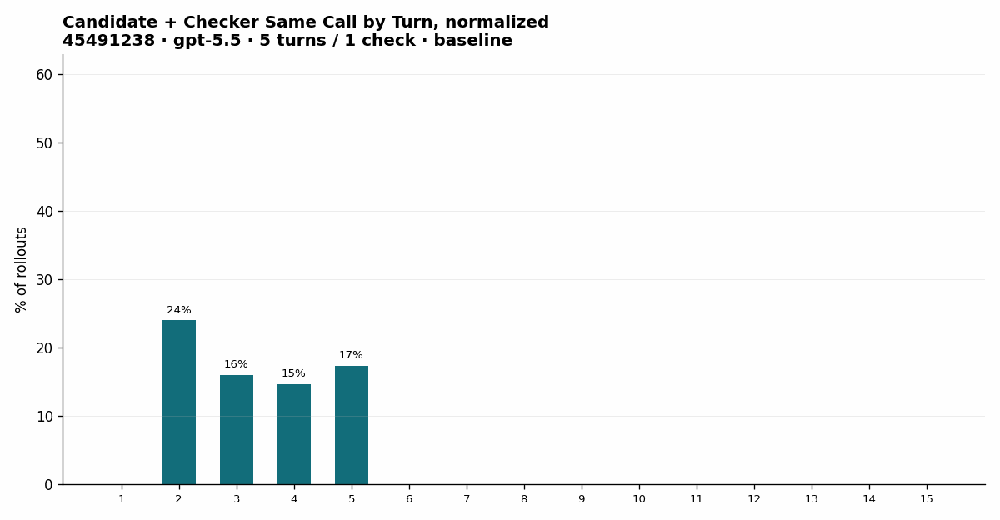

Interesting training behaviour: stronger RLM rollouts combine candidate generation with checker use in the same work step more often. The gif is normalized by rollout count, so it shows checking becoming part of revision rather than a final afterthought.

## Training setup

The task is to start from an unrelaxed crystal structure in CIF format and produce a better candidate at `/task/final.cif`. The reward gives partial credit for a valid parseable CIF, preserving composition, improving local geometry through bond and force-proxy checks, and finally lowering the formation-energy proxy. This makes the task useful for training because the model can get signal before it solves the hardest physical objective.

The training runs used the RLM environment rather than the old chat-shaped environment. The model was Qwen3.5-9B, trained on crystal relaxation rollouts with the filesystem, checker skill, and final-file contract exposed during training.

After a bit of experimentation, batch size became one of the first practical lessons. Below 128, the training signal was noisy enough to disrupt training, so I focused on batch sizes 128 and 256. Each rollout used a 10-turn budget with 2 checker calls allowed.

The public reports do not record every optimizer detail I would want in a perfect methods section, so I am not going to invent them here. What the reports do show consistently is the behavior surface: each checkpoint audit has 64 parsed rollout samples, reward, tool-call counts, checker timing, candidate/checker events, primary behavior labels, error taxonomies, and matched tool-call excerpts.

I looked at four reports:

| Run | Short name | Why it matters | Report |
|---|---|---|---|
| `e7oej0cxoe3j6lwy0tz9euou` | batch-256-style run | Main behavior-change run; reward peaked around step 90. | [Open report](../outputs/rlm_training_analysis/e7oej0cxoe3j6lwy0tz9euou/multi_step_report.html) |
| `pdjhyq25on9s4vyrxy04x87v` | batch-128-style run | Earlier peak around step 70; useful for comparing checker timing. | [Open report](../outputs/rlm_training_analysis/pdjhyq25on9s4vyrxy04x87v/multi_step_report.html) |
| `x7b6izuqqfn4ouzk79e9wpz4` | high-throughput long run | Later run with about 500 in-flight rollouts; strongest late reward in the report data. | [Open report](../outputs/rlm_training_analysis/x7b6izuqqfn4ouzk79e9wpz4/multi_step_report.html) |
| `o8spwu5abkdvne8oakwy02kx` | capped-throughput long run | Later run capped around 200 in-flight rollouts; useful as a cautionary comparison. | [Open report](../outputs/rlm_training_analysis/o8spwu5abkdvne8oakwy02kx/multi_step_report.html) |

The most meaningful single run for the first narrative is the batch-256-style run. It starts with a messy policy that wastes many calls on orientation and buggy code, then moves toward earlier checking, fewer tool errors, and more compact generate-check-revise loops.

| Run | Start reward | Peak reward | End reward | First checker, start -> end | Candidate+checker, start -> end | Mean calls, start -> end |
|---|---:|---:|---:|---:|---:|---:|
| Batch-256-style `e7oej0...` | `0.168` | `0.527` at step 90 | `0.510` | `4.19 -> 2.30` | `6 -> 294` | `9.53 -> 8.22` |
| Batch-128-style `pdjhy...` | `0.163` | `0.566` at step 70 | `0.470` | `4.56 -> 1.35` | `14 -> 514` | `9.94 -> 9.64` |
| High-throughput `x7b6...` | `0.139` | `0.639` at step 120 | `0.639` | `4.80 -> 1.00` | `13 -> 360` | `9.16 -> 7.80` |
| Capped-throughput `o8sp...` | `0.157` | `0.484` at step 20 | `0.459` | `4.82 -> 2.20` | `15 -> 226` | `9.88 -> 8.83` |

The table gives the training story in miniature. Reward moved, but the workflow moved too. The model learned to get to the checker earlier, spend fewer calls on harness orientation, and combine candidate generation with checking in the same step.

The interesting signal was the combination of those metrics. The model quickly moved toward a "learn by trying" strategy: less introduction, less wandering around the workspace, and more immediate attempts at candidate generation and checking. I connect this to the classic spaghetti-tower exercise, where children often outperform adults because they start testing structures sooner instead of spending the whole time planning.

In this environment, that behavior is rational. If a rollout times out or gets truncated, it scores like a failed trajectory. So the model learns that long orientation phases are expensive. It narrows the workflow toward actions that produce feedback: write something, check it, revise it, and keep enough budget to leave a final artifact.

## Real trace: generate, check, revise

The behavior shift is easiest to see through a real trace. The example below is from the high-throughput `x7b6...` report, step 120, sample 15. It reached reward `1.0`, used the checker immediately, and then searched along a lattice-scaling direction while watching bond score, force proxy, and formation energy.

The trace is still a crude scientific relaxation algorithm, but it is useful because it shows the policy doing work inside the environment: read the CIF, generate a candidate, read checker feedback, revise the candidate, and finally choose the best tradeoff it found.

<details>
<summary>Real rollout trace, condensed from report excerpts</summary>

```text
Run: x7b6izuqqfn4ouzk79e9wpz4
Step: 120
Sample: 15
Problem: ErSiNi
Reward: 1.0

Turn 1: input inspection
  The model reads /task/inputs/unrelaxed.cif.
  It identifies P1 symmetry, Er4 Si4 Ni4 composition, and an orthorhombic-looking cell:
  a=6.76058, b=4.12022, c=7.07398.

Turn 2: first candidate + checker
  It writes a slightly expanded candidate:
  a=7.10, b=4.25, c=7.35.
  Checker feedback:
    valid=false
    bond_score=0.577
    max_force_proxy=1.091
    formation_energy=3.528 eV/atom
  The feedback says bond lengths are unreasonable and force proxy indicates clashes.

Turn 3: larger candidate + checker
  It expands substantially:
  a=9.00, b=6.00, c=9.50.
  Checker feedback:
    valid=true
    bond_score=0.917
    max_force_proxy=0.827
    formation_energy=1.359 eV/atom
  Bond lengths improve, but the force proxy is still high.

Turns 4-8: search along the same edit direction
  a=10.50, b=7.00, c=11.00:
    bond_score=0.900, max_force_proxy=0.641, formation_energy=0.902
  a=12.00, b=8.00, c=13.00:
    formation_energy=-1.811, but bond_score=-1.0 because isolated atoms appear
  a=11.00, b=7.50, c=12.00:
    bond_score=1.0, max_force_proxy=0.520, formation_energy=0.168
  a=11.30, b=7.65, c=12.25:
    bond_score=1.0, max_force_proxy=0.490, formation_energy=-0.448
  a=11.55, b=7.75, c=12.50:
    bond_score=0.875, max_force_proxy=0.460, formation_energy=-0.987

Turn 9: too far
  a=11.75, b=7.85, c=12.75:
    formation_energy=-1.394, but bond_score=-1.0 because isolated atoms appear.

Turn 10: finalization
  The model returns to the seventh structure, the best balance it found:
    a=11.55, b=7.75, c=12.50
    bond_score=0.875
    formation_energy=-0.987 eV/atom
  It writes that candidate to /task/final.cif.
```

Two things are worth noticing. First, the model is doing more than formatting a CIF; it is running a bounded search over a physical artifact. Second, the search is still crude. It mostly scales the lattice and watches checker feedback, which is exactly why the next environment version should give the model better local-geometry editing tools.
</details>

## Component rewards

Top-line reward is too compressed for this task. The interesting question is which rung of the ladder the model reached.

```text
write a valid CIF
  -> preserve composition
  -> avoid bad local geometry
  -> reduce energy enough
  -> finish within the turn and check budget
```

Format became easy. The file contract helped a lot because the final answer was a file, not a span of chat text.

Composition became learnable. Several models could preserve or recover composition even when they failed the final score.

Bond lengths improved with budget and training. This often moved together with composition because both can be attacked through local geometry edits.

Formation energy stayed hard as the main gate between partial credit and full credit, and simple formatting, coordinate wrapping, or conservative perturbation rarely solved it.

Formation energy is the most interesting component because it is the genuinely scientific objective in this task. Format can be learned as a contract, composition can be protected by copying the right species, and bond lengths can often be improved through local cleanup. Formation energy asks whether the proposed structure is actually closer to a stable physical configuration, rather than whether it only looks like a valid CIF.

The figures below are the ones I would keep in the main body for the batch-256-style run: total reward, component rewards, and efficiency. They tell a cleaner story than a long list of scalar values in prose.

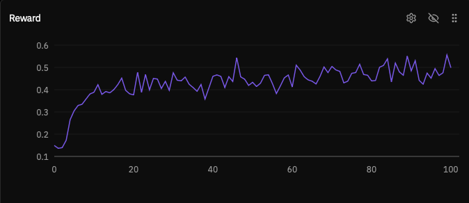

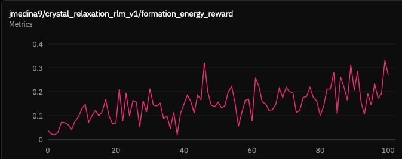

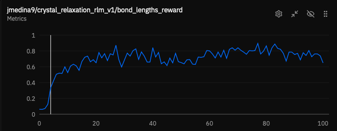

<details>
<summary>Additional component and efficiency plots</summary>

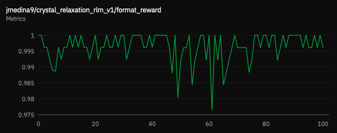

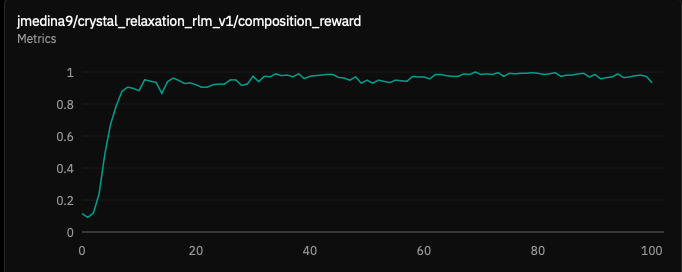

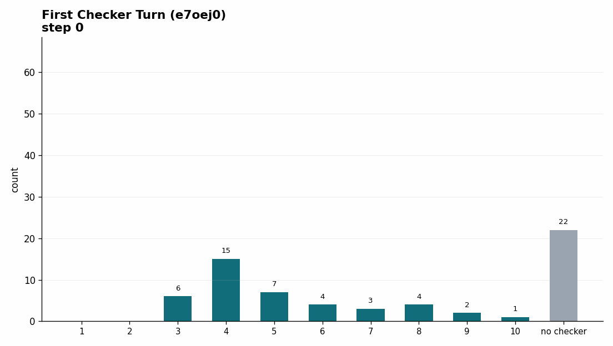

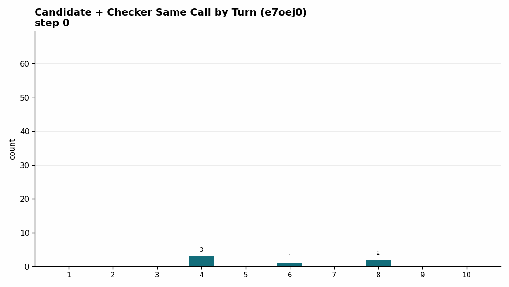

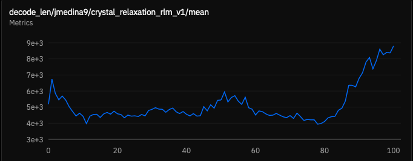

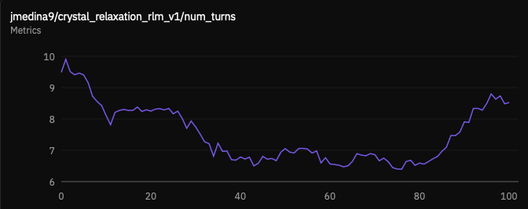
</details>

Different models got stuck at different rungs. GPT-5.5 could use extra checks to reach many full-credit structures. GPT-5.4-mini often reached the lower rungs but did not recover enough energy. Claude benefited from the larger budget but spent more turns. Gemini did not automatically improve when the budget grew.

### Length and efficiency

In the legacy `MultiTurnEnv` code, longer reasoning tended to appear only when the model scale was large enough and the problem was hard enough. The older 230B analysis showed richer and longer reasoning over training, while the 30B analysis showed the opposite pattern: reasoning compressed as the model learned safer heuristics.

The RLM version gives a different lens on the same issue. Length includes more than prose: tool turns, scratch code, checker calls, and file operations all matter.

The rough RLM pattern was:

1. Early training starts near the maximum turn budget because the model is inefficient.
2. Decode length and tool use decrease as the model learns easy reward components like format, composition, and bond lengths.
3. Length can increase again when the remaining gains require real search for lower-energy structures.

This resembles a pattern I have seen in other RL settings: if truncated traces score as zero, models quickly learn to avoid responses that run into truncation. In RLMs, the same pressure appears as workflow compression. The model stops spending turns on generic setup and starts spending them on actions that can change the score.

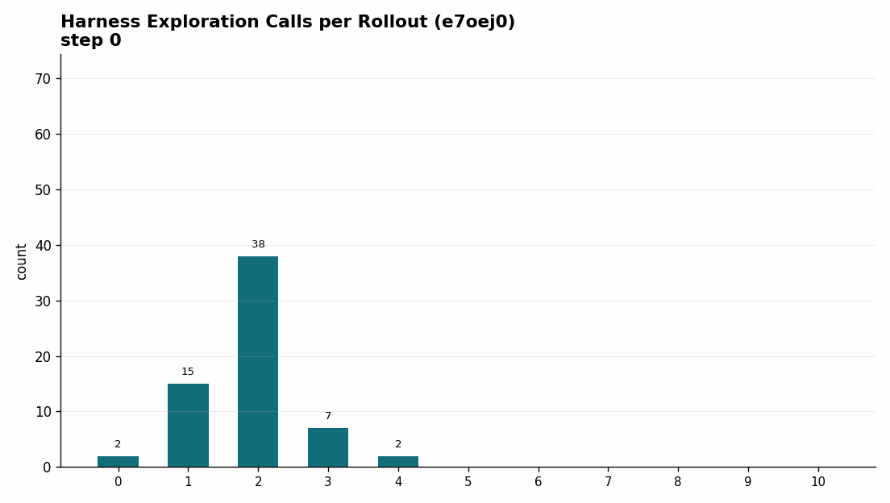

This harness-exploration plot shows how the agent distributes actions spent understanding the environment itself: reading task files, inspecting available tools, and orienting around the filesystem before producing candidate structures. The useful shift is not only shorter rollouts, but a better allocation of actions away from generic harness exploration and toward candidate generation, checking, and revision. This observation, together with the previous plots showing how agents also combine actions in a single tool call, gives two examples of how the LLM changes its behavior in favor of improving reward.

For this reason, "make it shorter" is the wrong training objective by itself. The better question is:

> When is extra tool use useful search, and when is it wasted motion?

For the main batch-256-style run, reward peaked around step 90 and then slightly declined by step 100. The useful interpretation is qualitative: the policy learned the workspace, then learned to exploit the checker, but formation energy remained the hard part.

## Code and error modes

At step 0 in the batch-256-style run, the audit counted `610` executed tool calls across `64` parsed rollouts. Mean reward was `0.168`, mean first checker turn was `4.19`, and the model spent many calls reading files, reading skills, and writing brittle scratch code.

The early errors were concrete:

- wrong Pymatgen imports and API expectations
- manual CIF parsing shape assumptions
- undefined variables after long scratch scripts
- syntax errors from malformed comprehensions or missing operators
- code that printed nothing, so the model had no observation to use
- CIFs that were written but rejected by parser or checker logic

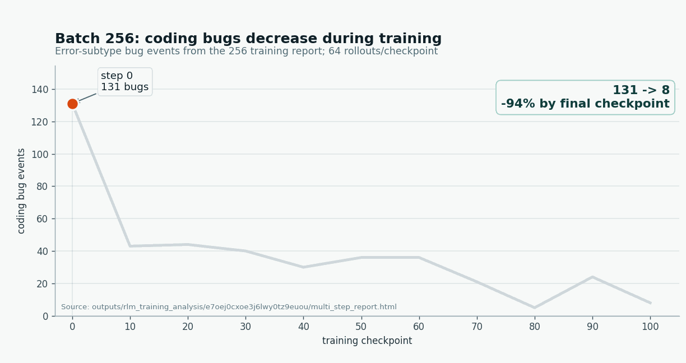

By step 100 in the same run, raw tool errors had fallen from `131/610` calls to `8/526` calls. For me, this was one of the clearest signs of learning in this setup: the model learned to write and execute code that was able to run in the provided environment.

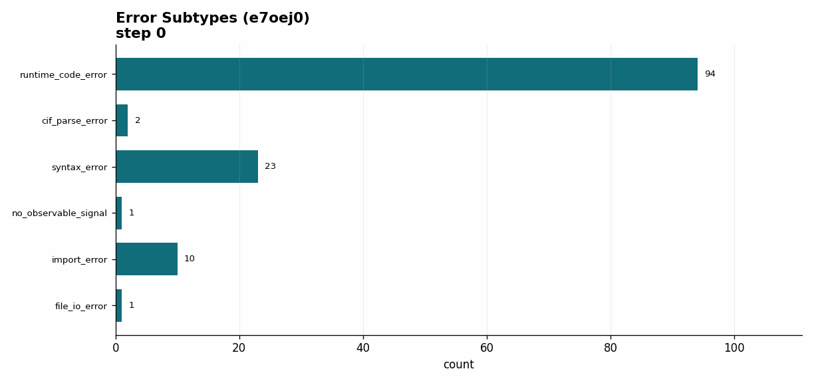

The error-subtype plot shows that the number of code errors decreases overall through training, but also that the first error modes corrected were syntax errors, import errors, and calls that failed to print an observable result. The agent is learning how to code better with scientific tools like Pymatgen even though there is no direct reward for "better Python." Later failures move toward CIF validity, check-budget tradeoffs, force proxy, and formation energy.

### Scheduler caveat

The later long runs add a scheduler caveat, but I would not make it a main conclusion. The high-throughput run reached about 500 in-flight rollouts and ended much stronger in the report data. The capped run sat near 200 in-flight rollouts, peaked earlier, and did not show the same sharp checker-timing shift.

My current hypothesis is that rollout scheduling and sample age may affect the behavior curriculum. Since this was not a controlled result, I would treat it as an operational clue rather than evidence that higher concurrency is inherently better.

## Why RLM then?

The old environment is still a good baseline. It is clean for short direct repair, and it showed that the task was solvable. But it did not expose the full work loop.

The RLM version trains and measures a different object: a model working inside a small scientific workspace. It must read files, write code, use a checker, revise artifacts, and leave a trace. This changed the project because wrong answers became inspectable.

The most important outcome is that the RLM formulation made meaningful training possible at smaller scale. In the old `MultiTurnEnv` setup, interesting reasoning changes seemed to require at least roughly 30B-parameter models, and the 230B run was where richer scientific reasoning really emerged. With the filesystem, skill, and checker loop exposed as an RLM task, I could train a 9B-scale model and see it learn a workable scientific workflow.

My read is that the 9B result moved the training signal to the right level, even though the model did not solve crystal relaxation. The model was no longer only learning how to emit a CIF-looking answer; it was learning how to operate in the workspace where the CIF is produced.

## Next experiments

The next version should treat turn and checker budgets as part of the curriculum. If a model is still failing format or composition, extra formation-energy search is wasted. Once format, composition, and bond lengths saturate, the curriculum can spend more budget on local search, checker-guided revision, or a more explicit structure-editing skill.

The budget curriculum is the next experiment I care about most. A fixed budget treats every training stage as if it needs the same kind of search, but the traces suggest otherwise. Early on, the model needs to learn the contract and stop wasting turns. Later, once the easy rungs are stable, it needs more room and better tools for the hard energy objective.

I also want to keep infrastructure failures separate from model failures. In the best GPT-5.5 RLM run, part of the zero-reward tail came from sandbox readiness rather than bad CIFs. I do not treat that as the same failure mode as a model producing a bad structure. The newer sandbox system should make this less central by improving startup reliability and scaling, so the next post should focus less on sandbox bottlenecks and more on controlled training changes.

The changes I would actually run next are:

- a budget curriculum that starts with few checks and expands only after format/composition are stable
- a stronger local-geometry editing skill that makes safe coordinate revisions easier
- evals that compare trained RLM policies against non-RLM policies on the same structures
- a cleaner ablation of checker wording, checker budget, and final scoring

## Artifacts

Start here:

- [RLM eval analysis](../outputs/rlm_eval_analysis/crystal-relaxation-rlm/multi_eval_report.html): the best place to compare eval runs, models, budgets, pass rates, and tool behavior.
- [Main batch-256-style training report](../outputs/rlm_training_analysis/e7oej0cxoe3j6lwy0tz9euou/multi_step_report.html): the clearest report for the first workflow-learning narrative.
- [High-throughput long training report, `x7b6izu...`](../outputs/rlm_training_analysis/x7b6izuqqfn4ouzk79e9wpz4/multi_step_report.html): later training report with the strongest late reward and the real trace used above.

Supporting reports:

- [Batch-128-style training report](../outputs/rlm_training_analysis/pdjhyq25on9s4vyrxy04x87v/multi_step_report.html): useful for comparing earlier checker timing and reward peaks.
- [Capped-throughput long training report, `o8spwu...`](../outputs/rlm_training_analysis/o8spwu5abkdvne8oakwy02kx/multi_step_report.html): comparison run capped near 200 in-flight rollouts.
- [Transition notes](../rlm_transition_report.md): local eval ids, platform ids, and classic-vs-RLM result tables.
- [Training observations](../observations_rlm_training.md): raw notes and generated audits for early tool-call behavior.

Background and source:

- [Original crystal relaxation post](blog_post.html): background on the first environment and why crystal relaxation was the target task.
- [Public RLM search environment](https://github.com/PrimeIntellect-ai/research-environments/tree/main/environments/rlm_search): reference environment for the taskset/harness/final-file pattern.
- [RLM harness source](https://github.com/PrimeIntellect-ai/rlm-harness): harness implementation used for agentic rollouts.
- [Earlier HTML narrative](../crystal_relaxation_multiturn_to_rlm_blog.html): previous writeup focused on the migration from `MultiTurnEnv` to RLM.
